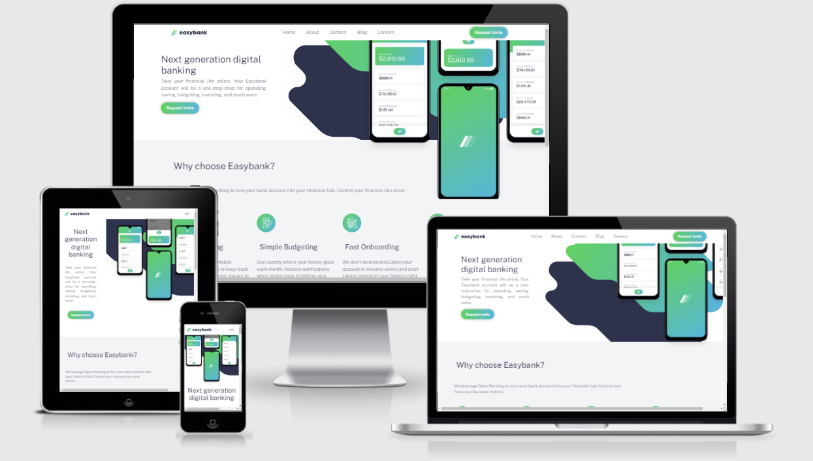

# Frontend Mentor - Easybank landing page

The purpose of this project is to build the Easybank landing page. 

My main obstacle in building of this website were the positioning of hero image and mobile phone positioning on top of the hero image. I've learn 
how to use :after pseudo element inside the container and positioning of relative and absolute position.

I added animation to the elements by using JS function IntersectionObserver

I really enjoyed the pocess.
